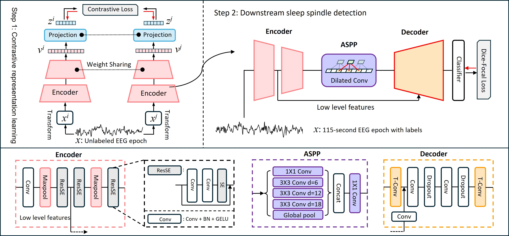
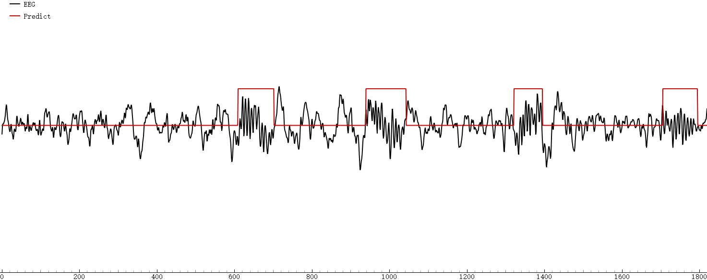
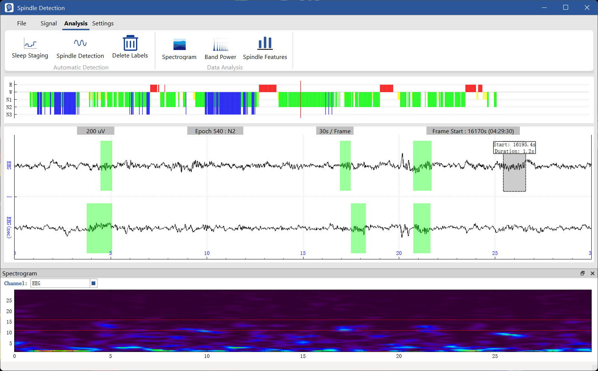

# S5
This repo is the official implementation of “***S5: Self-Supervised Learning Boosts Sleep Spindle Detection in Single-Channel EEG via Temporal Segmentation***”.

## Model Architecture

## Getting Started
### Prepare Environment
1. Set up a python environment:
```
conda create -n S5 python=3.9.19
conda activate S5
```

2. Install requirements using pip:
```
pip install -r requirements.txt
```

### Dataset Preparation
#### MASS
1. Apply for and download the MASS dataset from https://ceams-carsm.ca/mass/.
2. Modify the path settings in the `data/mass_cl/mass_to_numpy.py` file, then run `mass_to_numpy.py`.

#### MODA
1. Download MODA sleep spindle annotations from https://github.com/klacourse/MODA_GC
2.  Modify the path settings in the `data/moda_spindle/moda_to_numpy.py` file, then run `moda_to_numpy.py`.

## Train & Test
The `weight` directory stores the weights of our trained model. If you do not want to train, you can go directly to the Testing step to start testing.

### Contrastive Learning
1. Change `data_dir` in `config/mass_cl_config.json` to the location where you saved your MASS after processing it.
2. Start contrastive learning training:
```
python train.py --config config/mass_cl_config.json
```

### Sleep Spindle Detection
1. Change `data_dir` in `config/moda_sp_config.json` to the location where you saved your MODA after processing it.
2. Start spindle detection training:
```
python train.py --config config/moda_sp_config.json
```

###  Testing
1. Change `test_data_dir` in `test.py`, then run `test.py`.
```
python test.py
```

### Inference
We used a single subject (only EEG data retained) from the publicly available SHHS1(https://sleepdata.org/datasets/shhs) dataset on the NSRR website to demonstrate the actual inference steps.
```
python inference.py
```


## GUI
GUI can be obtained from another repository. https://github.com/Adrenaline613/SpindleDetector


## Code Structure
```
S5/
├── config/
│   ├── mass_cl_config.json  # Contrastive learning config
│   └── moda_sp_config.json  # MODA spindle detection config
├── data/
│   ├── utils.py
│   ├── mass_cl/
│   │   └── mass_to_numpy.py  # Processing MASS datasets
│   └── moda_spindle/
│       ├── moda_to_numpy.py  # Processing MODA datasets
│       └── split_list.py     # Division of training and test sets
├── edf4test/
│   ├── shhs1-eeg-only-profusion.xml  # XML file for recording sleep stages
│   └── shhs1-eeg-only.edf            # EDF for demonstrating inference
├── model/
│   ├── augmentation.py
│   ├── dataloder.py
│   ├── loss.py
│   ├── metric.py
│   ├── net.py
│   ├── postprocessing.py
│   ├── set_seed.py
│   └── trainer.py
├── plot/
│   └── qt_visualizer.py  # Visualization during inference
├── tensorboard/
│   ├── MASS_S3Net_pretrain_20250715/
│   └── MODA_S3Net_fullyfinetune_20250715/
├── weight/
│   ├── MASS_S3Net_pretrain_20250715/       # Contrastive learning weights
│   └── MODA_S3Net_fullyfinetune_20250715/  # MODA spindle detection weights
├── inference.py
├── requirements.txt
├── test.py
└── train.py
```
