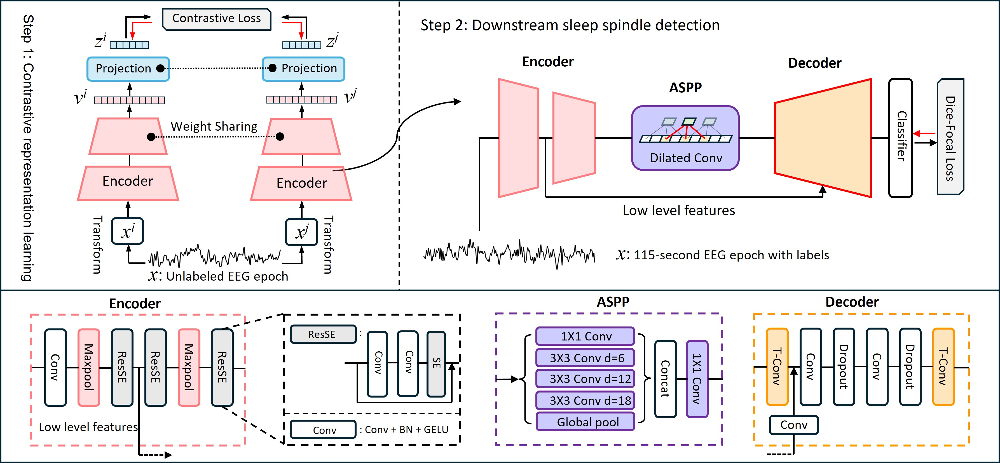
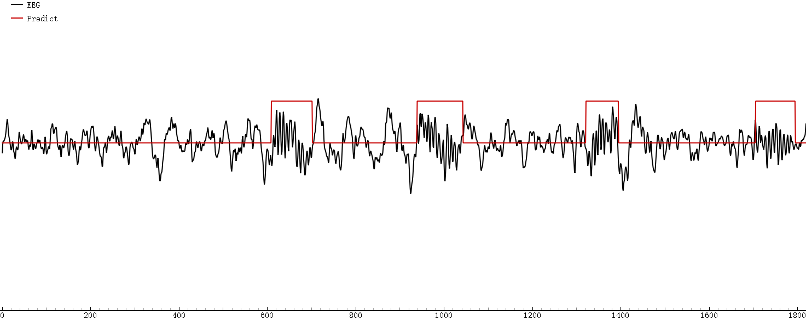
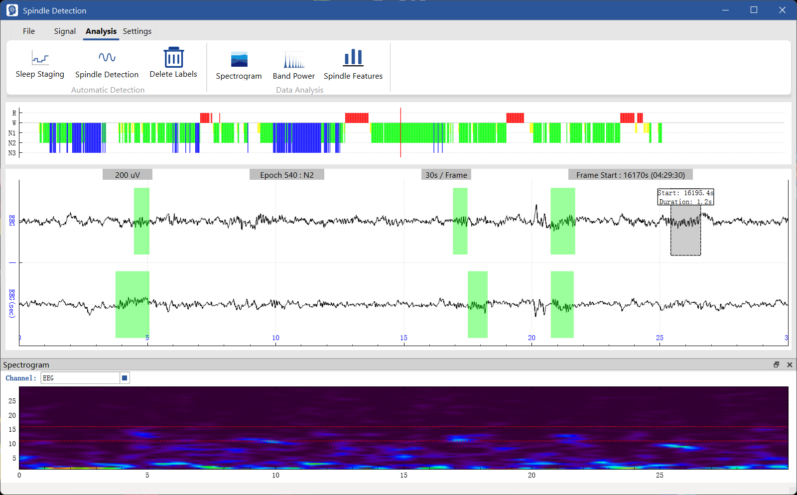

# S5
This repo is the official implementation of “***S5: Self-Supervised Learning Boosts Sleep Spindle Detection in Single-Channel EEG via Temporal Segmentation***”. (IEEE TBME)

## Model Architecture

## Getting Started
### Prepare Environment
1. Set up a python environment:
```
conda create -n S5 python=3.9.19
conda activate S5
```

2. Install requirements using pip:
```
pip install -r requirements.txt
```

### Dataset Preparation
#### MASS
1. Apply for and download the MASS dataset from https://ceams-carsm.ca/mass/.


#### MODA
1. Download MODA sleep spindle annotations from https://github.com/klacourse/MODA_GC
2.  Modify the path settings in the `data/moda_spindle/moda_to_numpy.py` file, then run `moda_to_numpy.py`.

## Test
The `weight` directory stores the weights of our trained model.

1. Change `test_data_dir` in `test.py`, then run `test.py`.
```
python test.py
```

## Inference (Detect sleep spindles using your own data)
We used a single subject (only EEG data retained) from the publicly available SHHS1(https://sleepdata.org/datasets/shhs) dataset on the NSRR website to demonstrate the actual inference steps.
```
python inference.py
```
inference.py contains a simple demonstration of the entire process from data loading, spindle wave detection, and spindle wave feature calculation.



Note that the trained model was obtained with an input length of 115s, but the input length for the demonstration inference was 30s. This causes only a very small performance degradation, but can significantly simplify the detection process.

## GUI
GUI can be obtained from another repository. https://github.com/Adrenaline613/SpindleDetector


## Code Structure
```
S5/
├── data/
│   ├── utils.py
│   └── moda_spindle/
│       ├── moda_to_numpy.py  # Processing MODA datasets
│       └── split_list.py     # Division of training and test sets
├── edf4test/
│   ├── shhs1-eeg-only-profusion.xml  # XML file for recording sleep stages
│   └── shhs1-eeg-only.edf            # EDF for demonstrating inference
├── model/
│   ├── dataloder.py
│   ├── metric.py
│   ├── net.py
│   ├── postprocessing.py
│   └── spindle_feature.py      # Calculation of spindle wave features
├── plot/
│   └── qt_visualizer.py  # Visualization during inference
├── tensorboard/
│   └── MODA_S3Net_fullyfinetune_20250715/
├── weight/
│   └── MODA_S3Net_fullyfinetune_20250715/  # MODA spindle detection weights
├── inference.py
├── requirements.txt
└── test.py
```
